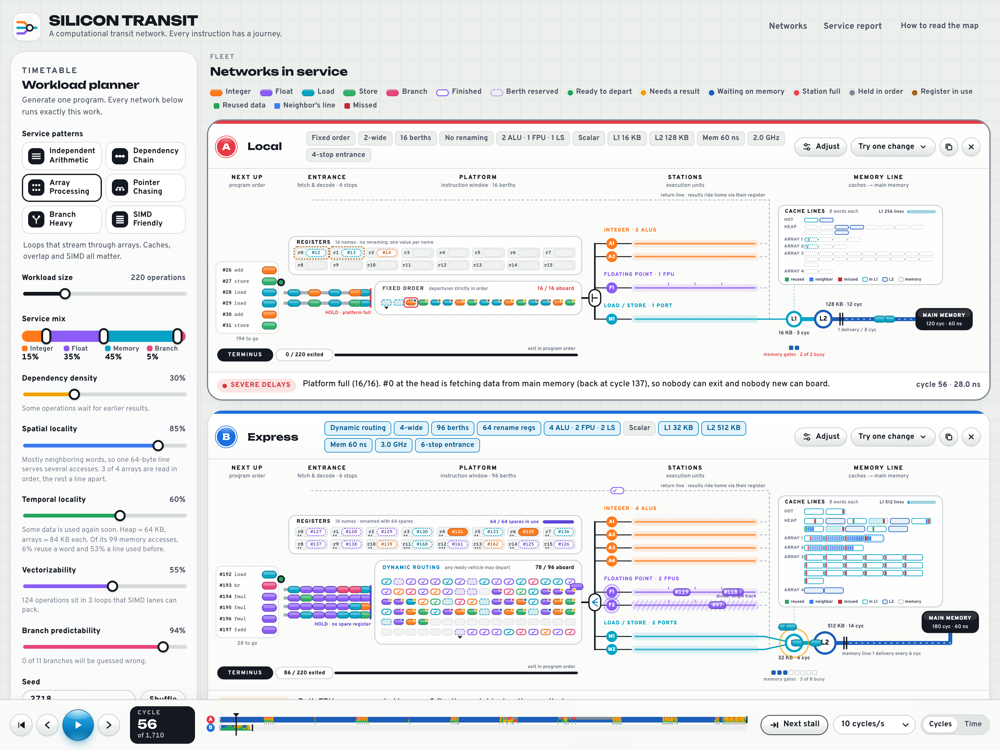

# Silicon Transit

An interactive, deterministic CPU simulator drawn as an optimistic Y2K
transit network. Generate a workload, configure fictional processors, and
watch the same work run on each one, then read a service report that explains
why one network was faster.

[Watch Local and Express run the same program (MP4, 60 fps)](media/local-vs-express.mp4)

Build and run: `node tools/build.mjs && open dist/standalone.html`

this project was entirely vibe coded - Jack
